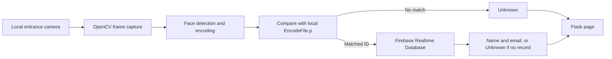

# Smart Parking Face Recognition

Computer-vision module for the **Smart Parking System**, a 2023 graduation project at Modern Academy's Computer Engineering and Information Technology Department. This component uses a webcam to identify a driver, looks up the registered driver's name and email in Firebase, and reports `Unknown` for an unregistered face.

> This repository contains the face-recognition component only. The graduation project also included the Rakna mobile app, parking-owner and admin web apps, Firebase-backed parking data, QR-code reservations, and parking hardware. Those separate components are described in the project report included under [`docs/`](docs/Smart%20Parking%20System_Documentation.pdf).

**Author:** Ebrahim Qlini Fahmy Qlini

**Project:** Smart Parking System graduation project, 2023

**Supervisor:** Dr. Seham Moawad

**Institution:** Modern Academy, Computer Engineering and Information Technology Department

## Project context

The graduation project addresses the time drivers spend searching for parking and the congestion this can cause. The complete system was designed to help drivers find nearby garages and available spaces, reserve a space, and use a QR code for parking entry and exit. Garage owners and administrators manage parking information through a web application, while sensors and barriers support the physical parking workflow.

This module was my part of that system. It was designed for the garage entrance: detect a face from the entrance camera, compare it with enrolled face encodings, then retrieve the associated driver record from Firebase. The result is shown on a local Flask web page. The project report describes the full graduation system and its design, requirements, hardware, applications, and face-recognition output.

## What this module does

1. Reads frames from a local webcam through OpenCV.
2. Detects a face and calculates its encoding with `face_recognition` and dlib.
3. Compares that encoding with the locally generated enrollment encodings.
4. Looks up a matched student ID under Firebase Realtime Database at `Students/<id>`.
5. Shows the name and email for a registered face, or `Unknown` when the face or its database record is not registered.
6. Streams the camera and current recognition status to a local Flask page.



## Technology

- Python 3.7 (64-bit), used by the original project environment
- Flask for the local web application
- OpenCV for webcam capture and video streaming
- `face_recognition` / dlib for face detection and face encodings
- NumPy for image and encoding operations
- Firebase Admin SDK and Firebase Realtime Database for driver records
- HTML, CSS, and JavaScript for the result page

## Repository layout

```text
.
├── AddDatatoDatabase.py       # Optional, confirmation-protected Firebase seeding
├── EncodeGenerator.py         # Builds local face encodings from Images/
├── firebase_config.py         # Loads local Firebase configuration
├── main.py                    # Flask app, camera stream, and face matching
├── requirements.txt
├── setup.ps1                  # Windows setup for the legacy Python 3.7 stack
├── students.example.json      # Fake example records; not real people
├── templates/
│   └── index.html
└── docs/
    └── Smart Parking System_Documentation.pdf
```

The face photos in `Images/`, generated encodings in `EncodeFile.p`, Firebase credentials, local `.env`, and the `output/` screenshots are kept out of the public source tree. They contain private or identifying data and are not needed to understand the code. Add your own authorized enrollment data locally before running recognition.

## Setup on Windows

The project uses an older computer-vision stack. The included setup script targets 64-bit Python 3.7 and installs the matching prebuilt dlib wheel, avoiding a local C++ build.

1. Install Python 3.7 (64-bit) and make sure the Windows `py` launcher can find it.
2. Open PowerShell in this folder and run:

   ```powershell
   .\setup.ps1
   ```

3. Put your Firebase service-account JSON in the project folder. Keep the file private; the default name is `serviceAccountKey.json`.
4. Edit `.env` with the Firebase Realtime Database URL and storage bucket for your Firebase project. `setup.ps1` creates `.env` from `.env.example` if it does not exist.
5. Create a local `Images/` folder. Add one clear face image per enrolled person and name each image with that person's Firebase student ID, for example `student-001.jpg`.
6. Generate the local face encodings:

   ```powershell
   .\venv\Scripts\python.exe EncodeGenerator.py
   ```

7. In Firebase Realtime Database, make sure each ID has a record under `Students/<id>` with at least a `name` field and, if available, an `email` field.

The example file `students.example.json` uses fake `example.com` addresses. To seed your own database, copy it to the ignored local file `students.json`, edit it with your own records, then run:

```powershell
.\venv\Scripts\python.exe AddDatatoDatabase.py
.\venv\Scripts\python.exe AddDatatoDatabase.py --apply
```

The first command previews the IDs. The second asks you to type `WRITE` before changing Firebase and overwrites records with matching IDs.

## Run the app

From the project folder:

```powershell
.\venv\Scripts\python.exe main.py
```

Open [http://127.0.0.1:5000](http://127.0.0.1:5000) in a browser. The local webcam is opened while the video page is being streamed. Press `Ctrl+C` in the terminal to stop the server and release the camera.

Optional settings in `.env`:

| Variable | Default | Purpose |
| --- | --- | --- |
| `FIREBASE_CREDENTIALS` | `serviceAccountKey.json` | Path to the private Firebase service-account JSON |
| `FIREBASE_DATABASE_URL` | Required | Firebase Realtime Database URL |
| `FIREBASE_STORAGE_BUCKET` | Optional | Firebase Storage bucket name |
| `CAMERA_INDEX` | `0` | OpenCV camera index |
| `FACE_PROCESS_EVERY_N_FRAMES` | `5` | Run detection every N camera frames |
| `FACE_MATCH_THRESHOLD` | `0.6` | Maximum face distance accepted as a match |

## Privacy and credentials

- Do not commit `serviceAccountKey.json`, `.env`, real student records, face photos, or generated encodings. `.gitignore` excludes these local files.
- Face images and encodings stay on the computer during enrollment and matching. `EncodeGenerator.py` does not upload face images to Firebase.
- The app sends a Firebase Realtime Database lookup for a matched student ID so it can display that person's record.
- `EncodeFile.p` is a Python pickle. Only load an encoding file generated by this project from data you trust.
- The Firebase seed script does not write until `--apply` is passed and `WRITE` is entered.

## Notes and limitations

- This is an academic prototype from 2023, not a production access-control or security system.
- The current interface is intended for one local camera and displays the first detected face.
- Recognition depends on camera placement, lighting, enrollment-image quality, the configured match threshold, and Firebase availability.
- The mobile app, owner/admin web applications, QR reservation flow, and parking hardware belong to the wider graduation project and are not implemented in this repository.

## Graduation project report

The complete **Smart Parking System** report is included at [`docs/Smart Parking System_Documentation.pdf`](docs/Smart%20Parking%20System_Documentation.pdf). It covers the project background and requirements, the Rakna mobile app, owner/admin web application, parking hardware, the face-recognition module, system simulation, conclusions, and future work.

---

## ملخص بالعربية

هذا المستودع يحتوي على جزء التعرّف على الوجوه من مشروع التخرج **Smart Parking System** لعام 2023 في الأكاديمية الحديثة، قسم هندسة الحاسب وتكنولوجيا المعلومات. يلتقط التطبيق صورة من كاميرا محلية، يقارن الوجه بالوجوه المسجلة، ثم يبحث عن الاسم والبريد الإلكتروني في Firebase. المشروع الأكبر يشمل تطبيق Rakna للحجز، ولوحة ويب لأصحاب الجراجات والإدارة، وأكواد QR وأجزاء الهاردوير. ملف التوثيق الكامل موجود في مجلد `docs`.
